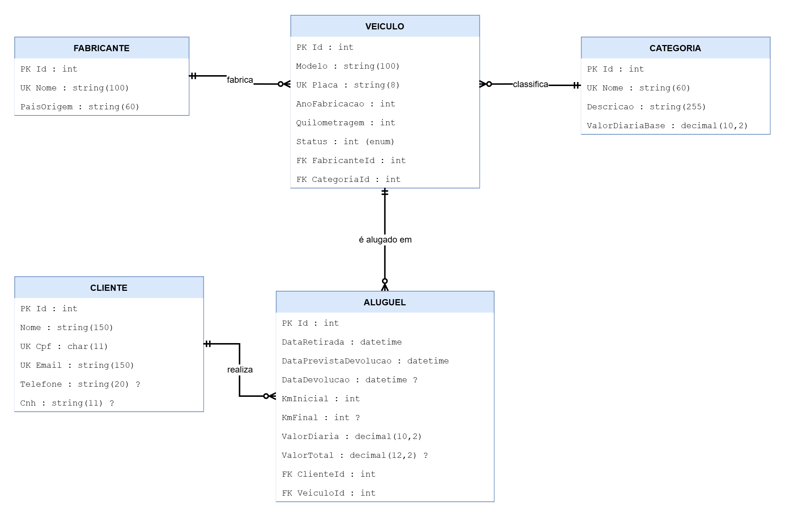
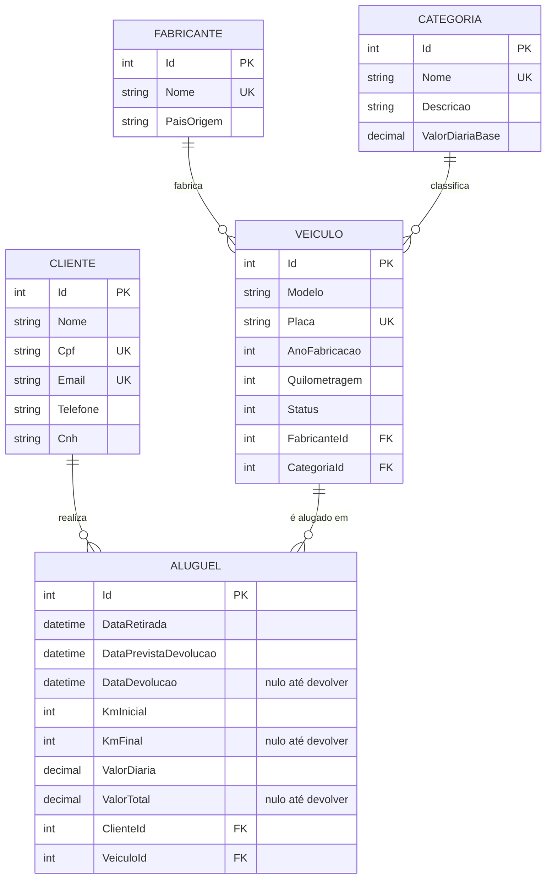

# Locadora de Veículos - Trabalho Prático 1

API em C# (.NET 8) + ASP.NET Core + Entity Framework Core + SQL Server Express + Swagger.

## Etapa 1 - Modelagem do Banco de Dados

### Modelo conceitual (DER)

Arquivos: [`docs/der.png`](docs/der.png) · [`docs/der.pdf`](docs/der.pdf) · fonte editável no diagrams.net [`docs/der.drawio`](docs/der.drawio)





### Entidades (5)

| Entidade | Descrição |
|---|---|
| Fabricante | Marca do veículo |
| Categoria | Classe do veículo (econômico, SUV...), com valor base da diária (entidade adicional) |
| Veiculo | Veículo da frota: fabricante, categoria, modelo, ano, quilometragem, status |
| Cliente | Nome, CPF, e-mail, telefone, CNH |
| Aluguel | Cliente + veículo + período, devolução, km inicial/final, diária e total |

### Restrições de integridade

- **PKs:** `Id` (identity) em todas as tabelas.
- **FKs** (todas `ON DELETE RESTRICT`, preservam histórico):
  `Veiculos.FabricanteId`, `Veiculos.CategoriaId`, `Alugueis.ClienteId`, `Alugueis.VeiculoId`.
- **Unique:** `Fabricantes.Nome`, `Categorias.Nome`, `Veiculos.Placa`, `Clientes.Cpf`, `Clientes.Email`.
- **Check:** ano entre 1900 e 2100; quilometragem >= 0; diárias > 0; devolução prevista >= retirada;
  devolução >= retirada; km final >= km inicial; valor total >= 0.
- **Nullable:** `DataDevolucao`, `KmFinal`, `ValorTotal` (preenchidos na devolução).

### Estrutura

```
Locadora.Api/
  Models/   entidades (Fabricante, Categoria, Veiculo, Cliente, Aluguel, StatusVeiculo)
  Data/     AppDbContext (Fluent API: chaves, índices, checks)
  Migrations/
```

### Como executar

Requisitos: .NET 8 SDK, SQL Server Express (`localhost\SQLEXPRESS`), `dotnet-ef`.

```bash
cd Locadora.Api
dotnet ef database update   # cria o banco LocadoraVeiculos
dotnet run                  # Swagger em /swagger
```

A connection string está em `Locadora.Api/appsettings.json`.

## Etapa 2 - Implementação do Backend

APIs RESTful com CRUD completo para as 5 entidades, usando `Dtos/` para entrada/saída (não expõe as entidades do EF diretamente) e validação via Data Annotations (`[Required]`, `[StringLength]`, `[Range]`, `[RegularExpression]`, `[EmailAddress]`, `IValidatableObject` para datas).

### Endpoints CRUD

| Recurso | Rotas |
|---|---|
| Fabricantes | `GET/POST /api/fabricantes`, `GET/PUT/DELETE /api/fabricantes/{id}` |
| Categorias | `GET/POST /api/categorias`, `GET/PUT/DELETE /api/categorias/{id}` |
| Veiculos | `GET/POST /api/veiculos`, `GET/PUT/DELETE /api/veiculos/{id}` |
| Clientes | `GET/POST /api/clientes`, `GET/PUT/DELETE /api/clientes/{id}` |
| Alugueis | `GET/POST /api/alugueis`, `GET/PUT/DELETE /api/alugueis/{id}`, `POST /api/alugueis/{id}/devolucao` |

### Regras de negócio (Alugueis)

- Só é possível criar aluguel se o veículo estiver com `Status = Disponivel` (senão `409 Conflict`).
- `KmInicial` é preenchido automaticamente com a quilometragem atual do veículo; ao criar o aluguel, `Veiculo.Status` passa para `Alugado`.
- `POST /api/alugueis/{id}/devolucao` recebe `KmFinal` (e opcionalmente `DataDevolucao`), calcula `ValorTotal` (dias corridos arredondados para cima × `ValorDiaria`), atualiza a quilometragem do veículo e volta `Status` para `Disponivel`.
- Aluguel já devolvido não pode ser editado (`PUT`) nem devolvido novamente.
- `DELETE` de um aluguel ainda ativo libera o veículo (`Status = Disponivel`).

### 5 filtros com joins (item 2.5)

| # | Rota | Join |
|---|---|---|
| 1 | `GET /api/veiculos/disponiveis?categoriaId=&fabricanteId=` | INNER JOIN Veiculos × Categorias × Fabricantes (`Include`) |
| 2 | `GET /api/veiculos/por-fabricante/{fabricanteId}` | INNER JOIN Veiculos × Fabricantes × Categorias (`Include`) |
| 3 | `GET /api/alugueis/por-cliente/{clienteId}` | INNER JOIN Alugueis × Clientes × Veiculos (LINQ `join` explícito) |
| 4 | `GET /api/alugueis/atrasados` | INNER JOIN Alugueis × Clientes × Veiculos (LINQ `join` explícito) |
| 5 | `GET /api/clientes/sem-alugueis` | LEFT JOIN Clientes × Alugueis (`GroupJoin` + `SelectMany(DefaultIfEmpty)`) |

### Tratamento de erros

- `[ApiController]` retorna `400` automaticamente com `ProblemDetails` para falhas de validação dos DTOs.
- Violações de índice único ou de FK (`DbUpdateException`) são convertidas em `409 Conflict` com mensagem descritiva.
- Exceções não tratadas caem no middleware global (`UseExceptionHandler` em `Program.cs`) e retornam `500` em formato `ProblemDetails`.
- Enums (`StatusVeiculo`) trafegam como string no JSON (`Disponivel`/`Alugado`/`Manutencao`).

## Etapa 3 - Testes e Documentação

- **Swagger (3.1):** integrado via Swashbuckle, em `/swagger` (Development). Inclui título/descrição da API, comentários XML (`<summary>`) em cada endpoint e os códigos de resposta (`ProducesResponseType`) de cada rota.
- **Documentação dos endpoints (3.2):** [`docs/API.md`](docs/API.md) - métodos HTTP, parâmetros, regras de validação e códigos de resposta.
- **Relatório de testes (3.3):** [`docs/RELATORIO-TESTES.md`](docs/RELATORIO-TESTES.md) - 35 testes pelo Swagger UI (todos os endpoints, os 5 filtros com join e os principais erros 400/409), cada um com chamada, retorno e print em [`docs/prints/`](docs/prints).
