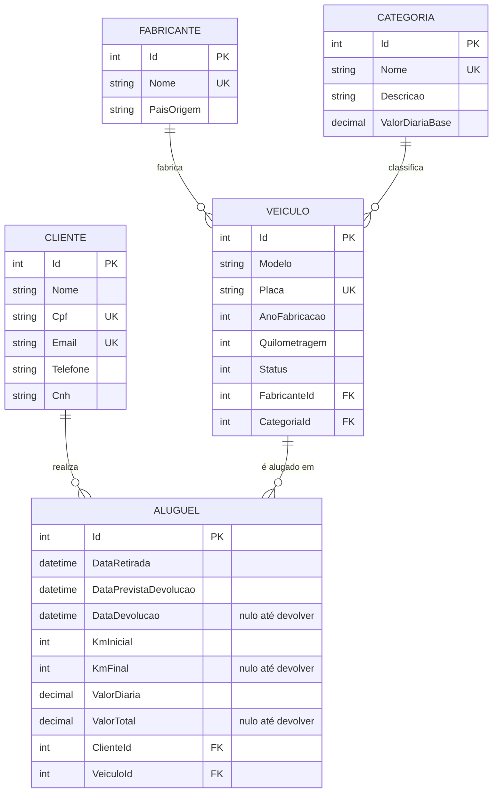

# Locadora de Veículos - Trabalho Prático 1

API em C# (.NET 8) + ASP.NET Core + Entity Framework Core + SQL Server Express + Swagger.

## Etapa 1 - Modelagem do Banco de Dados

### Modelo conceitual (DER)

Arquivos: [`docs/der.png`](docs/der.png) · [`docs/der.pdf`](docs/der.pdf) · fonte editável no diagrams.net [`docs/der.drawio`](docs/der.drawio)




### Entidades (5)

| Entidade | Descrição |
|---|---|
| Fabricante | Marca do veículo |
| Categoria | Classe do veículo (econômico, SUV...), com valor base da diária (entidade adicional) |
| Veiculo | Veículo da frota: fabricante, categoria, modelo, ano, quilometragem, status |
| Cliente | Nome, CPF, e-mail, telefone, CNH |
| Aluguel | Cliente + veículo + período, devolução, km inicial/final, diária e total |

### Restrições de integridade

- **PKs:** `Id` (identity) em todas as tabelas.
- **FKs** (todas `ON DELETE RESTRICT`, preservam histórico):
  `Veiculos.FabricanteId`, `Veiculos.CategoriaId`, `Alugueis.ClienteId`, `Alugueis.VeiculoId`.
- **Unique:** `Fabricantes.Nome`, `Categorias.Nome`, `Veiculos.Placa`, `Clientes.Cpf`, `Clientes.Email`.
- **Check:** ano entre 1900 e 2100; quilometragem >= 0; diárias > 0; devolução prevista >= retirada;
  devolução >= retirada; km final >= km inicial; valor total >= 0.
- **Nullable:** `DataDevolucao`, `KmFinal`, `ValorTotal` (preenchidos na devolução).

### Estrutura

```
Locadora.Api/
  Models/   entidades (Fabricante, Categoria, Veiculo, Cliente, Aluguel, StatusVeiculo)
  Data/     AppDbContext (Fluent API: chaves, índices, checks)
  Migrations/
```

### Como executar

Requisitos: .NET 8 SDK, SQL Server Express (`localhost\SQLEXPRESS`), `dotnet-ef`.

```bash
cd Locadora.Api
dotnet ef database update   # cria o banco LocadoraVeiculos
dotnet run                  # Swagger em /swagger
```

A connection string está em `Locadora.Api/appsettings.json`.
