# Relatório de Testes - Locadora de Veículos API

Testes manuais realizados pelo Swagger UI (`http://localhost:5215/swagger`), ambiente Development, banco SQL Server Express `LocadoraVeiculos` iniciado vazio.
Foram executadas 63 chamadas ao todo (algumas só para montar os dados de teste, como cadastros de apoio); este relatório documenta 35, cobrindo todos os endpoints, os 5 filtros com join e os principais cenários de erro. Cada teste mostra a chamada (método, URL e corpo), o código HTTP e o corpo retornado, com print da tela do Swagger.

**Resumo:** 35 testes documentados, 35 com o resultado esperado. Cenários de erro (400, 409) trazem o código esperado no título.

| # | Teste | Chamada | Status |
|---|---|---|---|
| 1 | [Cadastrar fabricante (Toyota)](#teste-1) | `POST /api/Fabricantes` | 201 |
| 2 | [Listar fabricantes](#teste-2) | `GET /api/Fabricantes` | 200 |
| 3 | [Obter fabricante por Id](#teste-3) | `GET /api/Fabricantes/{id}` | 200 |
| 4 | [Atualizar fabricante](#teste-4) | `PUT /api/Fabricantes/{id}` | 204 |
| 5 | [Remover fabricante](#teste-5) | `DELETE /api/Fabricantes/{id}` | 204 |
| 6 | [Cadastrar categoria (Econômico)](#teste-6) | `POST /api/Categorias` | 201 |
| 7 | [Listar categorias](#teste-7) | `GET /api/Categorias` | 200 |
| 8 | [Obter categoria por Id](#teste-8) | `GET /api/Categorias/{id}` | 200 |
| 9 | [Atualizar categoria](#teste-9) | `PUT /api/Categorias/{id}` | 204 |
| 10 | [Remover categoria](#teste-10) | `DELETE /api/Categorias/{id}` | 204 |
| 11 | [Cadastrar cliente (João)](#teste-11) | `POST /api/Clientes` | 201 |
| 12 | [Listar clientes](#teste-12) | `GET /api/Clientes` | 200 |
| 13 | [Obter cliente por Id](#teste-13) | `GET /api/Clientes/{id}` | 200 |
| 14 | [Atualizar cliente](#teste-14) | `PUT /api/Clientes/{id}` | 204 |
| 15 | [Remover cliente](#teste-15) | `DELETE /api/Clientes/{id}` | 204 |
| 16 | [Cadastrar veículo (Corolla)](#teste-16) | `POST /api/Veiculos` | 201 |
| 17 | [Listar veículos](#teste-17) | `GET /api/Veiculos` | 200 |
| 18 | [Obter veículo por Id](#teste-18) | `GET /api/Veiculos/{id}` | 200 |
| 19 | [Atualizar veículo](#teste-19) | `PUT /api/Veiculos/{id}` | 204 |
| 20 | [Cadastrar veículo com placa inválida (400)](#teste-20) | `POST /api/Veiculos` | 400 |
| 21 | [Remover veículo](#teste-21) | `DELETE /api/Veiculos/{id}` | 204 |
| 22 | [Filtro 1 - Veículos disponíveis (sem filtros)](#teste-22) | `GET /api/Veiculos/disponiveis` | 200 |
| 23 | [Filtro 2 - Veículos por fabricante](#teste-23) | `GET /api/Veiculos/por-fabricante/{fabricanteId}` | 200 |
| 24 | [Remover fabricante com veículos vinculados (409)](#teste-24) | `DELETE /api/Fabricantes/{id}` | 409 |
| 25 | [Registrar aluguel (João x Corolla)](#teste-25) | `POST /api/Alugueis` | 201 |
| 26 | [Registrar aluguel de veículo já alugado (409)](#teste-26) | `POST /api/Alugueis` | 409 |
| 27 | [Listar aluguéis](#teste-27) | `GET /api/Alugueis` | 200 |
| 28 | [Obter aluguel por Id](#teste-28) | `GET /api/Alugueis/{id}` | 200 |
| 29 | [Atualizar aluguel](#teste-29) | `PUT /api/Alugueis/{id}` | 204 |
| 30 | [Filtro 3 - Aluguéis por cliente](#teste-30) | `GET /api/Alugueis/por-cliente/{clienteId}` | 200 |
| 31 | [Filtro 4 - Aluguéis atrasados](#teste-31) | `GET /api/Alugueis/atrasados` | 200 |
| 32 | [Filtro 5 - Clientes sem aluguéis](#teste-32) | `GET /api/Clientes/sem-alugueis` | 200 |
| 33 | [Registrar devolução do veículo](#teste-33) | `POST /api/Alugueis/{id}/devolucao` | 200 |
| 34 | [Devolução repetida (409)](#teste-34) | `POST /api/Alugueis/{id}/devolucao` | 409 |
| 35 | [Remover aluguel](#teste-35) | `DELETE /api/Alugueis/{id}` | 204 |

## Fabricantes

<a id="teste-1"></a>
### Teste 1 - Cadastrar fabricante (Toyota)

- **Chamada:** `POST /api/Fabricantes`
- **Status retornado:** `201`

**Corpo enviado:**

```json
{
  "nome": "Toyota",
  "paisOrigem": "Japão"
}
```

**Retorno:**

```json
{
  "id": 1,
  "nome": "Toyota",
  "paisOrigem": "Japão"
}
```

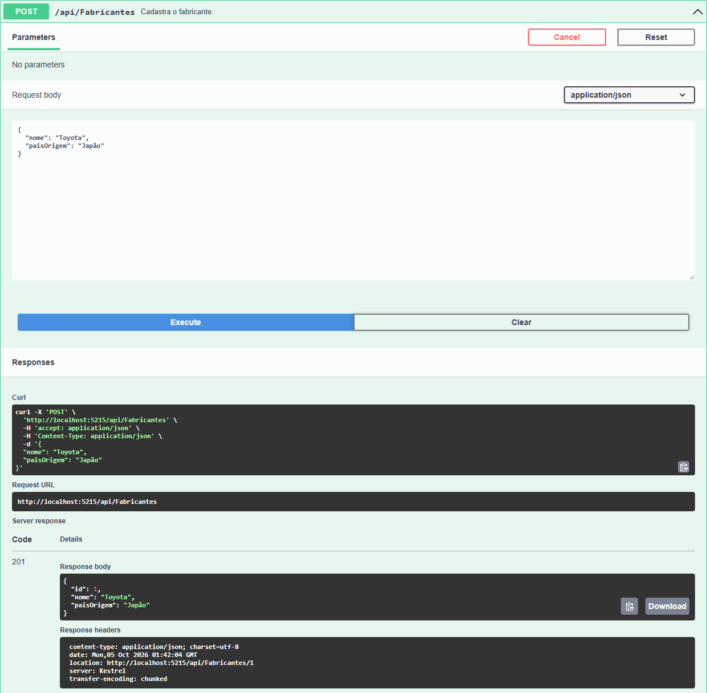

<a id="teste-2"></a>
### Teste 2 - Listar fabricantes

- **Chamada:** `GET /api/Fabricantes`
- **Status retornado:** `200`

**Retorno:**

```json
[
  {
    "id": 2,
    "nome": "Fiat",
    "paisOrigem": "Itália"
  },
  {
    "id": 1,
    "nome": "Toyota",
    "paisOrigem": "Japão"
  }
]
```

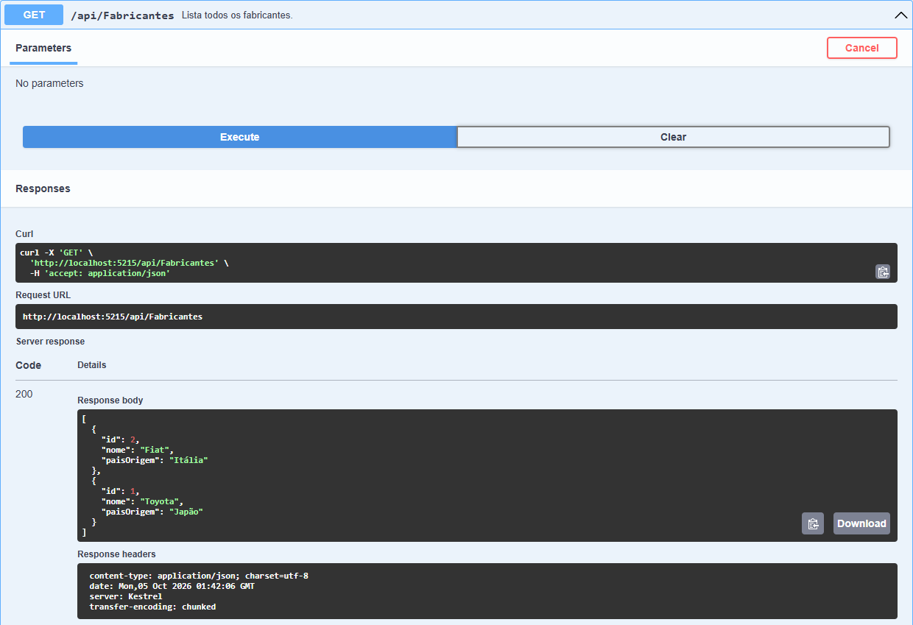

<a id="teste-3"></a>
### Teste 3 - Obter fabricante por Id

- **Chamada:** `GET /api/Fabricantes/1`
- **Status retornado:** `200`

**Retorno:**

```json
{
  "id": 1,
  "nome": "Toyota",
  "paisOrigem": "Japão"
}
```

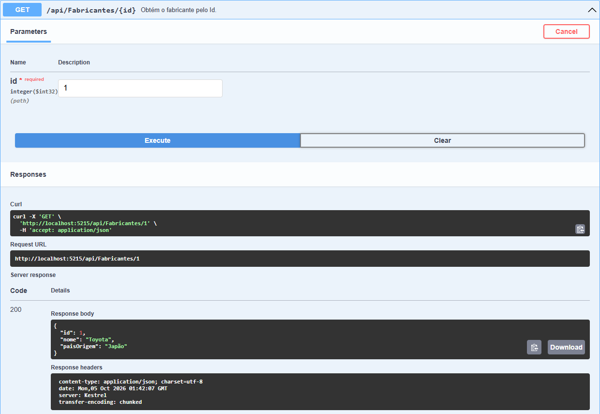

<a id="teste-4"></a>
### Teste 4 - Atualizar fabricante

- **Chamada:** `PUT /api/Fabricantes/2`
- **Status retornado:** `204`

**Corpo enviado:**

```json
{
  "nome": "Fiat Automóveis",
  "paisOrigem": "Itália"
}
```

**Retorno:**

```json
date: Mon,05 Oct 2026 01:42:09 GMT 
 server: Kestrel
```

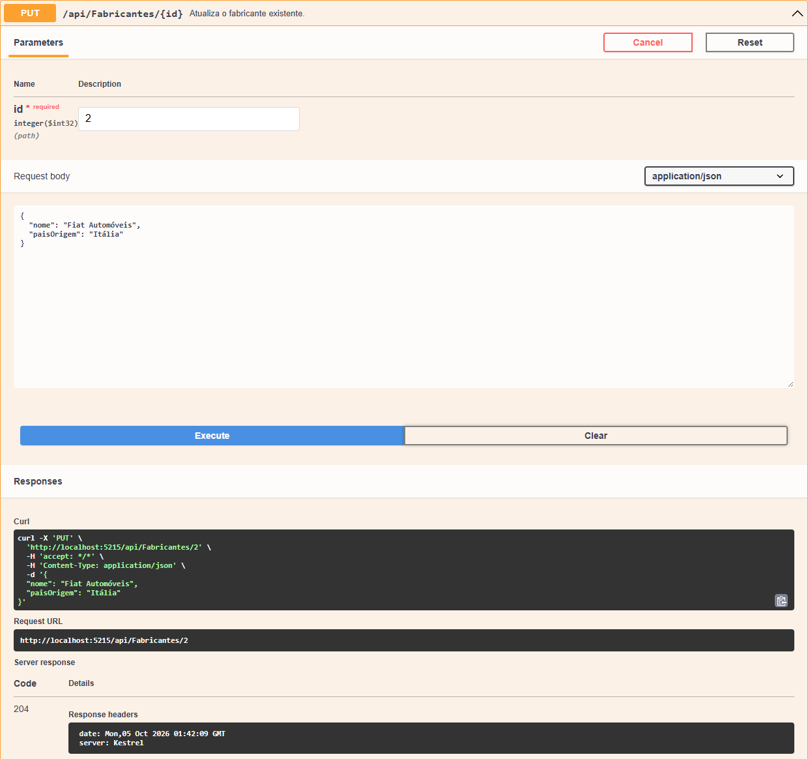

<a id="teste-5"></a>
### Teste 5 - Remover fabricante

- **Chamada:** `DELETE /api/Fabricantes/4`
- **Status retornado:** `204`

**Retorno:**

```json
date: Mon,05 Oct 2026 01:42:12 GMT 
 server: Kestrel
```

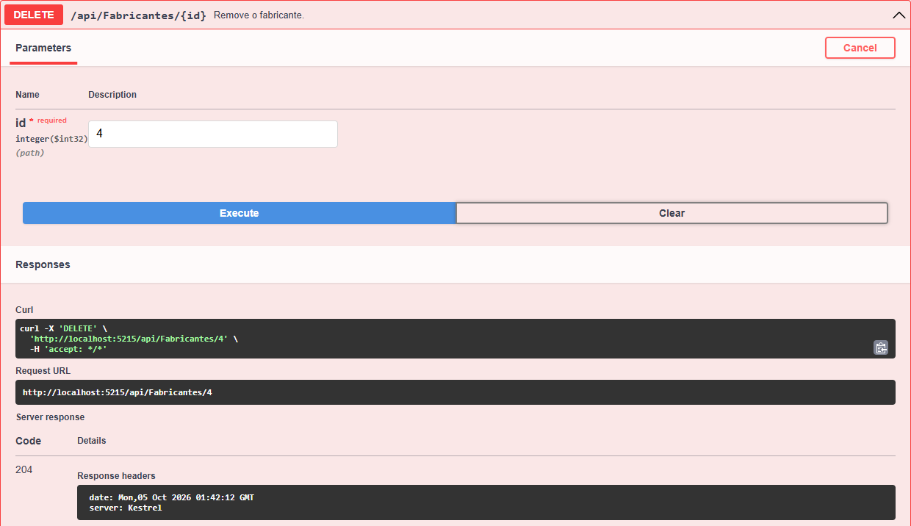

<a id="teste-24"></a>
### Teste 24 - Remover fabricante com veículos vinculados (409)

- **Chamada:** `DELETE /api/Fabricantes/1`
- **Status retornado:** `409`

**Retorno:**

```json
{
  "mensagem": "Fabricante possui veículos vinculados e não pode ser removido."
}
```

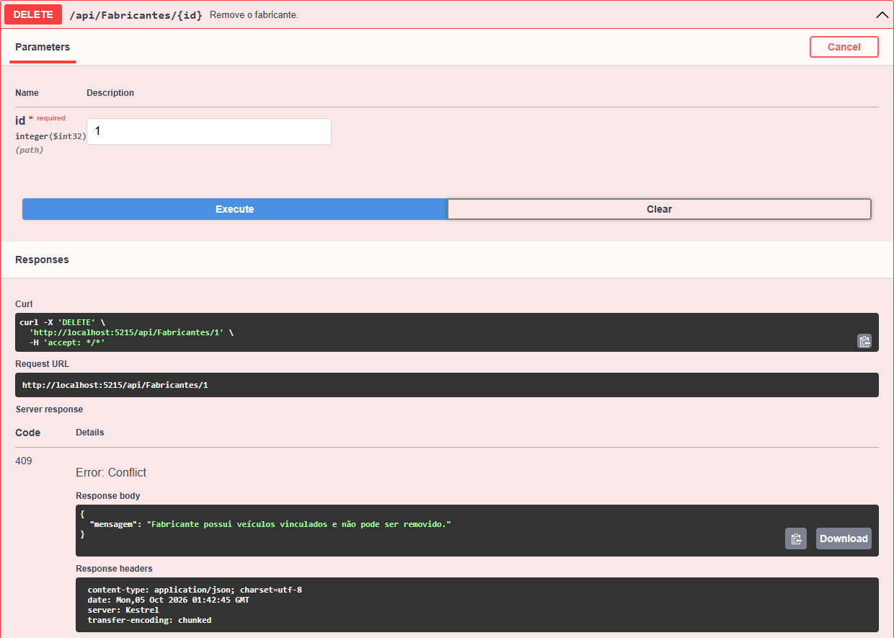

## Categorias

<a id="teste-6"></a>
### Teste 6 - Cadastrar categoria (Econômico)

- **Chamada:** `POST /api/Categorias`
- **Status retornado:** `201`

**Corpo enviado:**

```json
{
  "nome": "Econômico",
  "descricao": "Carros compactos e econômicos",
  "valorDiariaBase": 120
}
```

**Retorno:**

```json
{
  "id": 1,
  "nome": "Econômico",
  "descricao": "Carros compactos e econômicos",
  "valorDiariaBase": 120
}
```

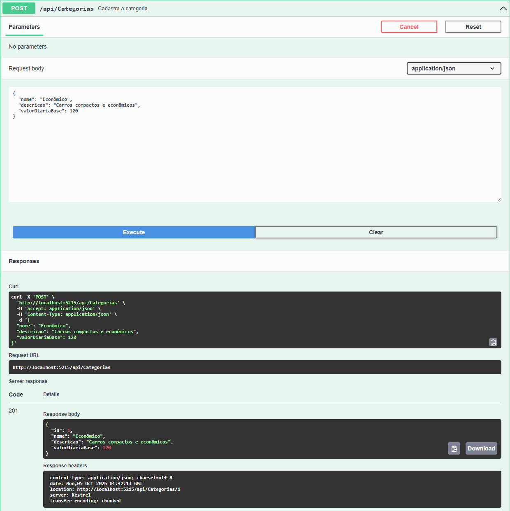

<a id="teste-7"></a>
### Teste 7 - Listar categorias

- **Chamada:** `GET /api/Categorias`
- **Status retornado:** `200`

**Retorno:**

```json
[
  {
    "id": 1,
    "nome": "Econômico",
    "descricao": "Carros compactos e econômicos",
    "valorDiariaBase": 120
  },
  {
    "id": 2,
    "nome": "SUV",
    "descricao": "Utilitários esportivos",
    "valorDiariaBase": 250
  }
]
```

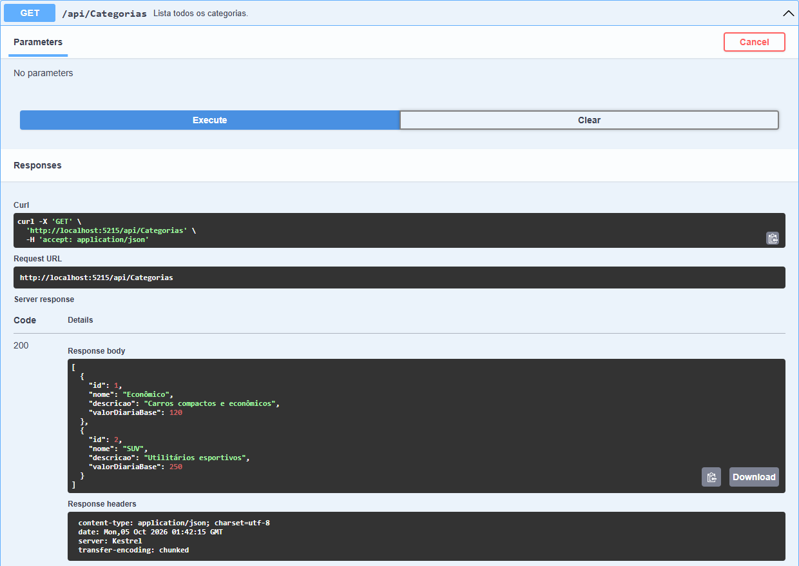

<a id="teste-8"></a>
### Teste 8 - Obter categoria por Id

- **Chamada:** `GET /api/Categorias/1`
- **Status retornado:** `200`

**Retorno:**

```json
{
  "id": 1,
  "nome": "Econômico",
  "descricao": "Carros compactos e econômicos",
  "valorDiariaBase": 120
}
```

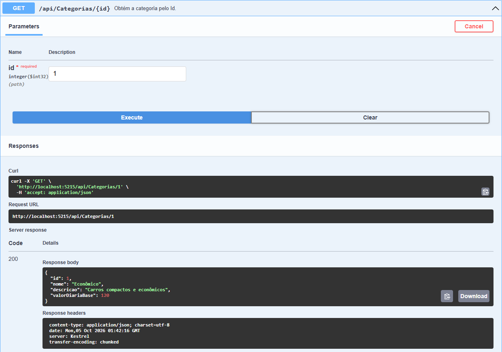

<a id="teste-9"></a>
### Teste 9 - Atualizar categoria

- **Chamada:** `PUT /api/Categorias/2`
- **Status retornado:** `204`

**Corpo enviado:**

```json
{
  "nome": "SUV",
  "descricao": "Utilitários esportivos e picapes",
  "valorDiariaBase": 280
}
```

**Retorno:**

```json
date: Mon,05 Oct 2026 01:42:17 GMT 
 server: Kestrel
```

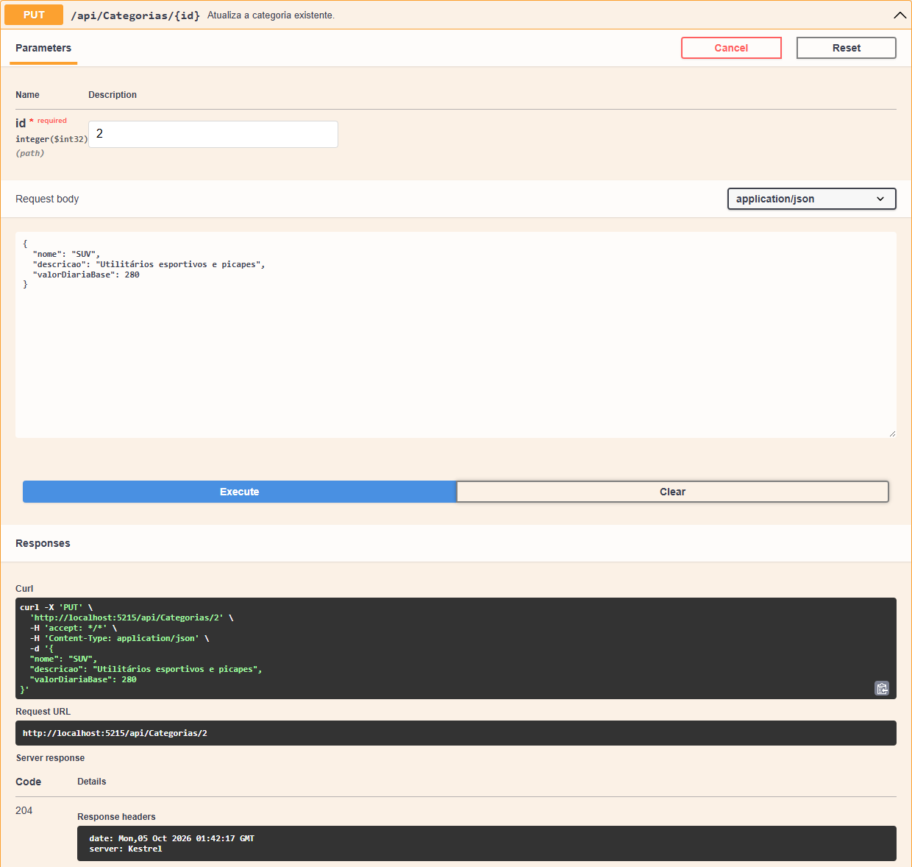

<a id="teste-10"></a>
### Teste 10 - Remover categoria

- **Chamada:** `DELETE /api/Categorias/3`
- **Status retornado:** `204`

**Retorno:**

```json
date: Mon,05 Oct 2026 01:42:20 GMT 
 server: Kestrel
```


## Clientes

<a id="teste-11"></a>
### Teste 11 - Cadastrar cliente (João)

- **Chamada:** `POST /api/Clientes`
- **Status retornado:** `201`

**Corpo enviado:**

```json
{
  "nome": "João da Silva",
  "cpf": "12345678901",
  "email": "joao@email.com",
  "telefone": "31999990001",
  "cnh": "12345678900"
}
```

**Retorno:**

```json
{
  "id": 1,
  "nome": "João da Silva",
  "cpf": "12345678901",
  "email": "joao@email.com",
  "telefone": "31999990001",
  "cnh": "12345678900"
}
```

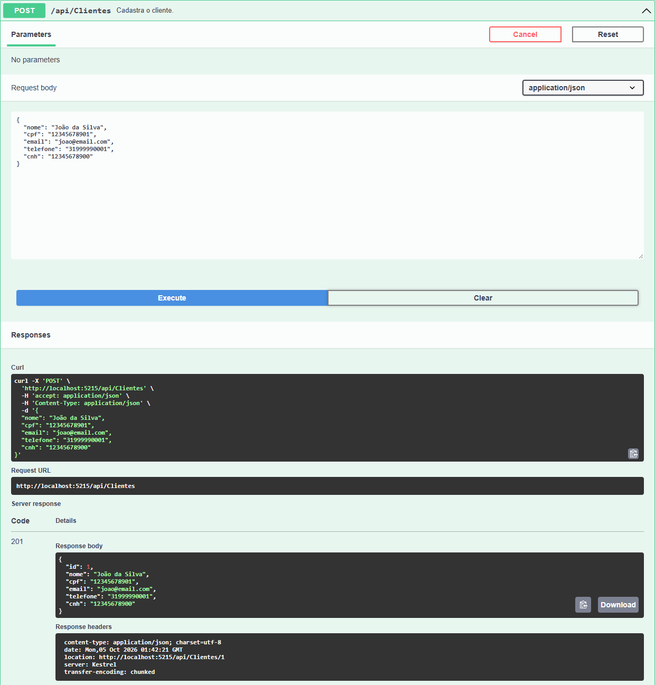

<a id="teste-12"></a>
### Teste 12 - Listar clientes

- **Chamada:** `GET /api/Clientes`
- **Status retornado:** `200`

**Retorno:**

```json
[
  {
    "id": 1,
    "nome": "João da Silva",
    "cpf": "12345678901",
    "email": "joao@email.com",
    "telefone": "31999990001",
    "cnh": "12345678900"
  },
  {
    "id": 2,
    "nome": "Maria Souza",
    "cpf": "98765432100",
    "email": "maria@email.com",
    "telefone": "31999990002",
    "cnh": "98765432100"
  },
  {
    "id": 3,
    "nome": "Pedro Alves",
    "cpf": "11122233344",
    "email": "pedro@email.com",
    "telefone": "31999990003",
    "cnh": "11122233344"
  }
]
```

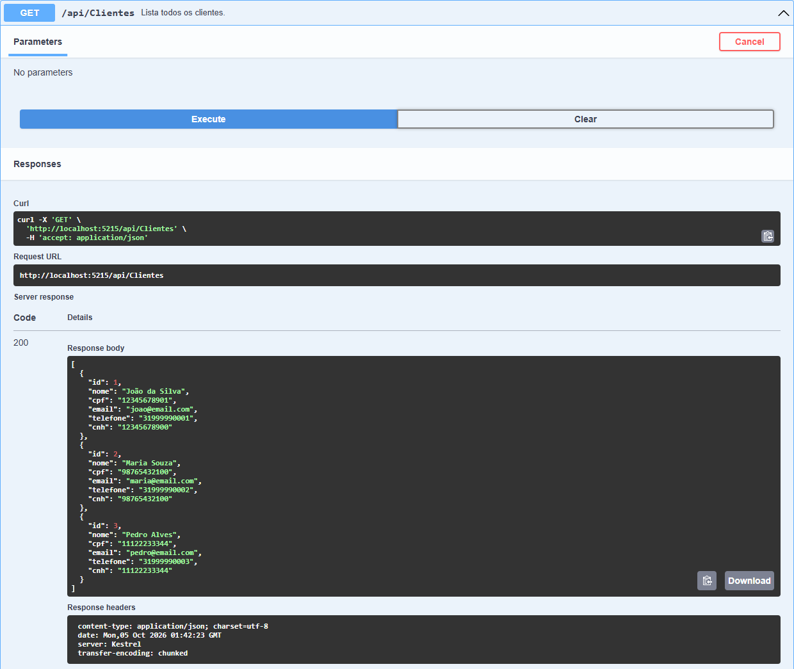

<a id="teste-13"></a>
### Teste 13 - Obter cliente por Id

- **Chamada:** `GET /api/Clientes/1`
- **Status retornado:** `200`

**Retorno:**

```json
{
  "id": 1,
  "nome": "João da Silva",
  "cpf": "12345678901",
  "email": "joao@email.com",
  "telefone": "31999990001",
  "cnh": "12345678900"
}
```

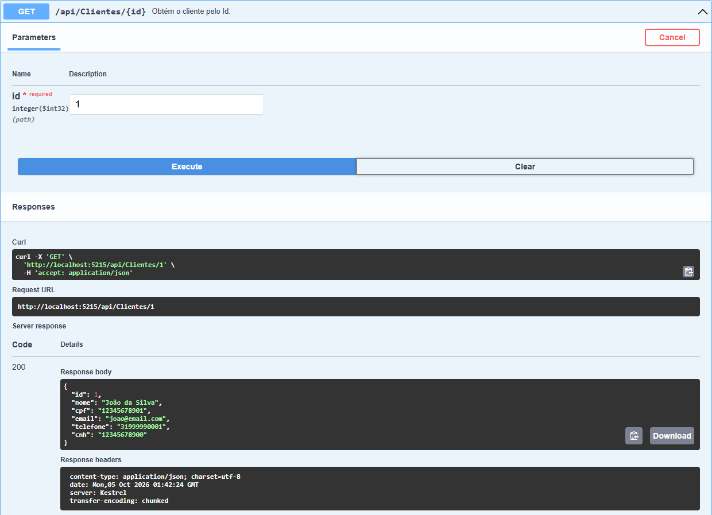

<a id="teste-14"></a>
### Teste 14 - Atualizar cliente

- **Chamada:** `PUT /api/Clientes/3`
- **Status retornado:** `204`

**Corpo enviado:**

```json
{
  "nome": "Pedro Alves Santos",
  "cpf": "11122233344",
  "email": "pedro@email.com",
  "telefone": "31988887777",
  "cnh": "11122233344"
}
```

**Retorno:**

```json
date: Mon,05 Oct 2026 01:42:26 GMT 
 server: Kestrel
```

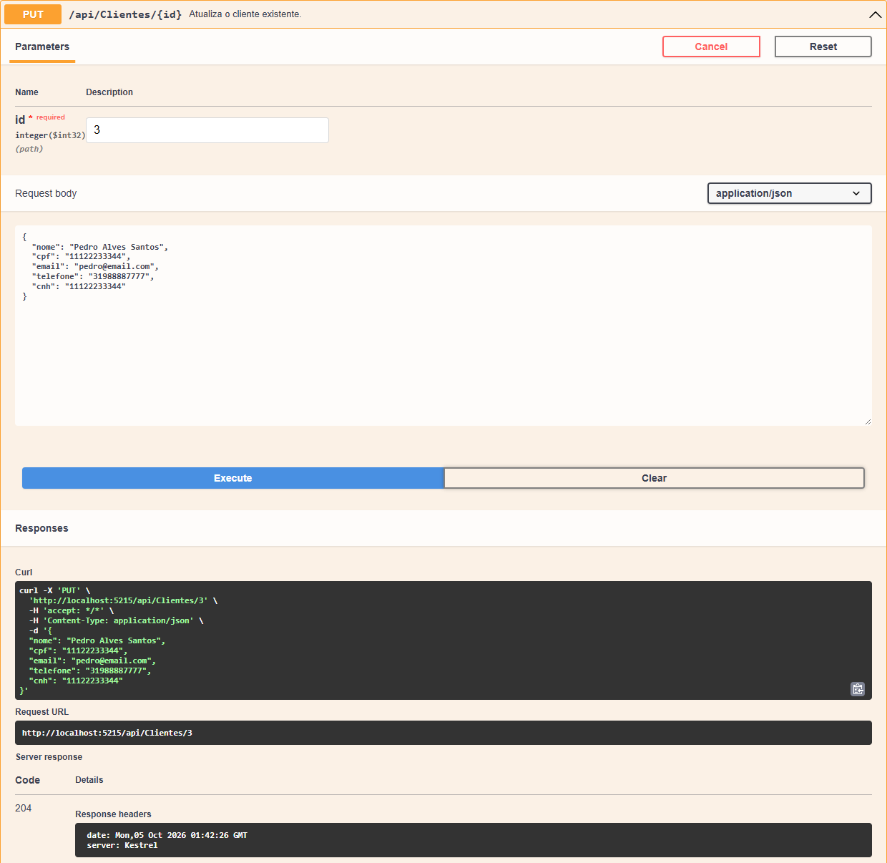

<a id="teste-15"></a>
### Teste 15 - Remover cliente

- **Chamada:** `DELETE /api/Clientes/5`
- **Status retornado:** `204`

**Retorno:**

```json
date: Mon,05 Oct 2026 01:42:29 GMT 
 server: Kestrel
```


<a id="teste-32"></a>
### Teste 32 - Filtro 5 - Clientes sem aluguéis

- **Chamada:** `GET /api/Clientes/sem-alugueis`
- **Status retornado:** `200`

**Retorno:**

```json
[
  {
    "id": 3,
    "nome": "Pedro Alves Santos",
    "cpf": "11122233344",
    "email": "pedro@email.com",
    "telefone": "31988887777",
    "cnh": "11122233344"
  }
]
```

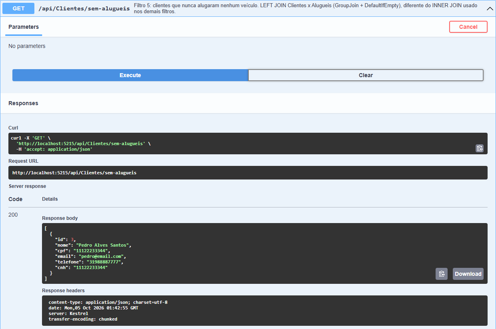

## Veículos

<a id="teste-16"></a>
### Teste 16 - Cadastrar veículo (Corolla)

- **Chamada:** `POST /api/Veiculos`
- **Status retornado:** `201`

**Corpo enviado:**

```json
{
  "modelo": "Corolla",
  "placa": "ABC1D23",
  "anoFabricacao": 2022,
  "quilometragem": 15000,
  "status": "Disponivel",
  "fabricanteId": 1,
  "categoriaId": 1
}
```

**Retorno:**

```json
{
  "id": 1,
  "modelo": "Corolla",
  "placa": "ABC1D23",
  "anoFabricacao": 2022,
  "quilometragem": 15000,
  "status": "Disponivel",
  "fabricanteId": 1,
  "fabricanteNome": "Toyota",
  "categoriaId": 1,
  "categoriaNome": "Econômico",
  "valorDiariaBase": 120
}
```

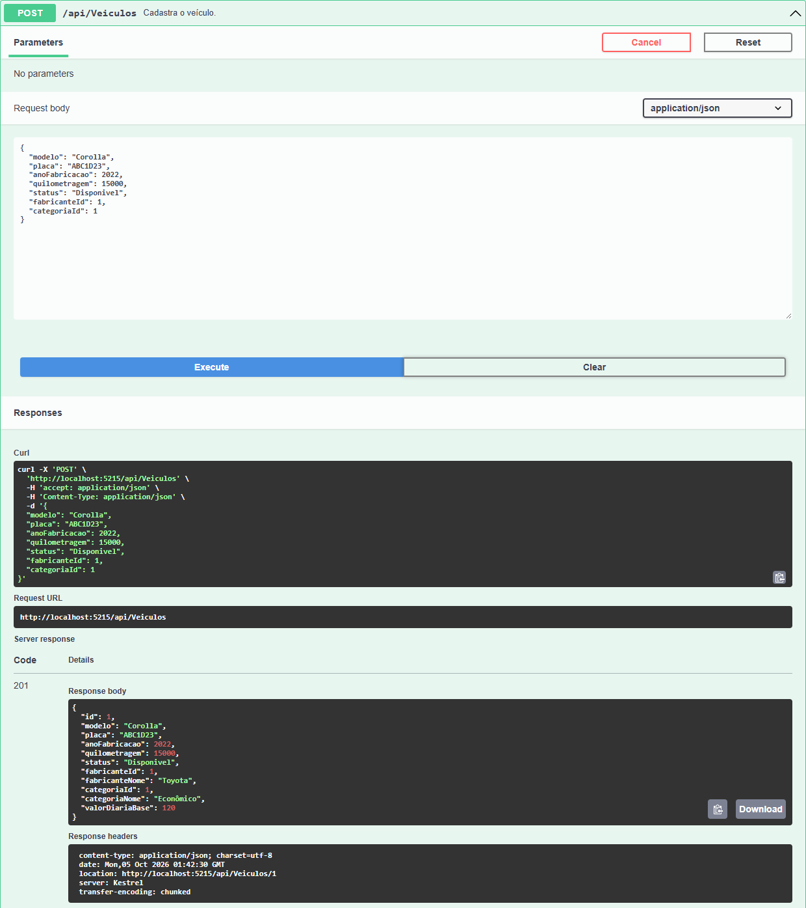

<a id="teste-17"></a>
### Teste 17 - Listar veículos

- **Chamada:** `GET /api/Veiculos`
- **Status retornado:** `200`

**Retorno:**

```json
[
  {
    "id": 2,
    "modelo": "Argo",
    "placa": "DEF4G56",
    "anoFabricacao": 2023,
    "quilometragem": 8000,
    "status": "Disponivel",
    "fabricanteId": 2,
    "fabricanteNome": "Fiat Automóveis",
    "categoriaId": 1,
    "categoriaNome": "Econômico",
    "valorDiariaBase": 120
  },
  {
    "id": 1,
    "modelo": "Corolla",
    "placa": "ABC1D23",
    "anoFabricacao": 2022,
    "quilometragem": 15000,
    "status": "Disponivel",
    "fabricanteId": 1,
    "fabricanteNome": "Toyota",
    "categoriaId": 1,
    "categoriaNome": "Econômico",
    "valorDiariaBase": 120
  },
  {
    "id": 3,
    "modelo": "Hilux SW4",
    "placa": "GHI7J89",
    "anoFabricacao": 2021,
    "quilometragem": 42000,
    "status": "Disponivel",
    "fabricanteId": 1,
    "fabricanteNome": "Toyota",
    "categoriaId": 2,
    "categoriaNome": "SUV",
    "valorDiariaBase": 280
  }
]
```

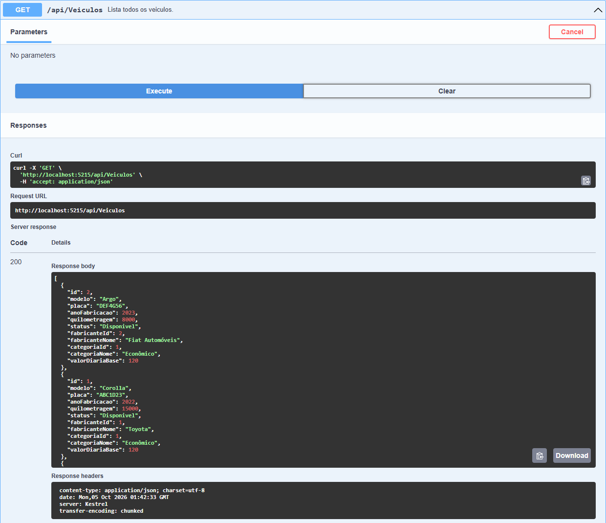

<a id="teste-18"></a>
### Teste 18 - Obter veículo por Id

- **Chamada:** `GET /api/Veiculos/1`
- **Status retornado:** `200`

**Retorno:**

```json
{
  "id": 1,
  "modelo": "Corolla",
  "placa": "ABC1D23",
  "anoFabricacao": 2022,
  "quilometragem": 15000,
  "status": "Disponivel",
  "fabricanteId": 1,
  "fabricanteNome": "Toyota",
  "categoriaId": 1,
  "categoriaNome": "Econômico",
  "valorDiariaBase": 120
}
```

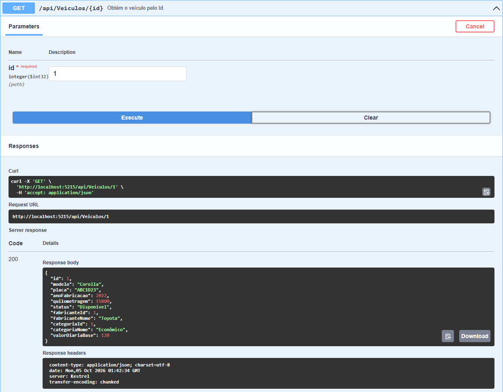

<a id="teste-19"></a>
### Teste 19 - Atualizar veículo

- **Chamada:** `PUT /api/Veiculos/3`
- **Status retornado:** `204`

**Corpo enviado:**

```json
{
  "modelo": "Hilux SW4",
  "placa": "GHI7J89",
  "anoFabricacao": 2021,
  "quilometragem": 43500,
  "status": "Disponivel",
  "fabricanteId": 1,
  "categoriaId": 2
}
```

**Retorno:**

```json
date: Mon,05 Oct 2026 01:42:36 GMT 
 server: Kestrel
```

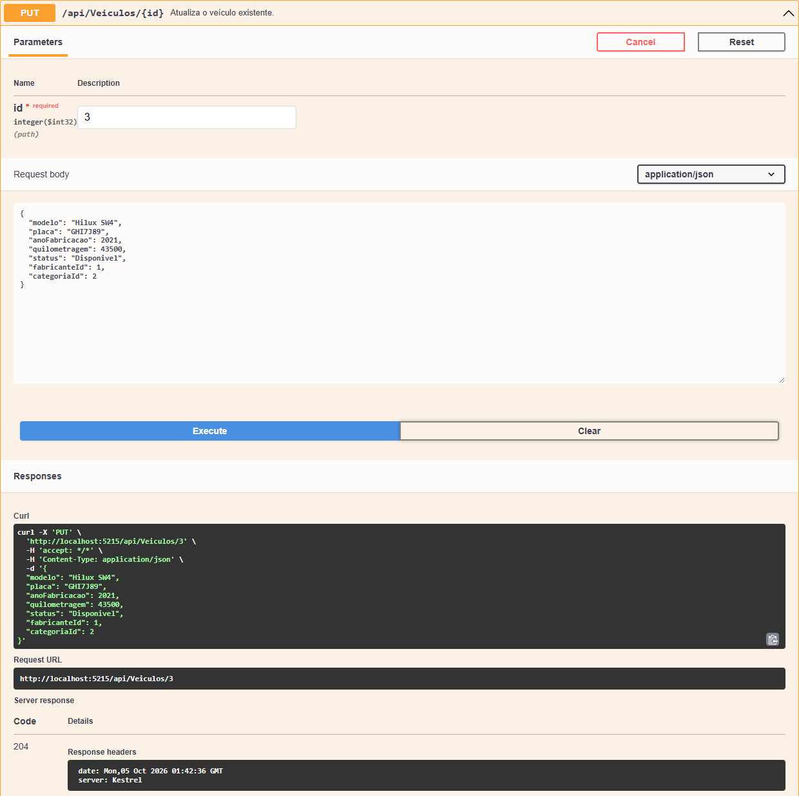

<a id="teste-20"></a>
### Teste 20 - Cadastrar veículo com placa inválida (400)

- **Chamada:** `POST /api/Veiculos`
- **Status retornado:** `400`

**Corpo enviado:**

```json
{
  "modelo": "X",
  "placa": "123",
  "anoFabricacao": 1800,
  "quilometragem": -1,
  "status": "Disponivel",
  "fabricanteId": 1,
  "categoriaId": 1
}
```

**Retorno:**

```json
{
  "type": "https://tools.ietf.org/html/rfc9110#section-15.5.1",
  "title": "One or more validation errors occurred.",
  "status": 400,
  "errors": {
    "Placa": [
      "Placa deve seguir o padrão AAA0000 ou AAA0A00 (Mercosul), sem hífen."
    ],
    "Modelo": [
      "The field Modelo must be a string with a minimum length of 2 and a maximum length of 100."
    ],
    "AnoFabricacao": [
      "The field AnoFabricacao must be between 1900 and 2100."
    ],
    "Quilometragem": [
      "The field Quilometragem must be between 0 and 2147483647."
    ]
  },
  "traceId": "00-894781c470b4f0fb24c1977ce179ad84-05278104561ceb76-00"
}
```

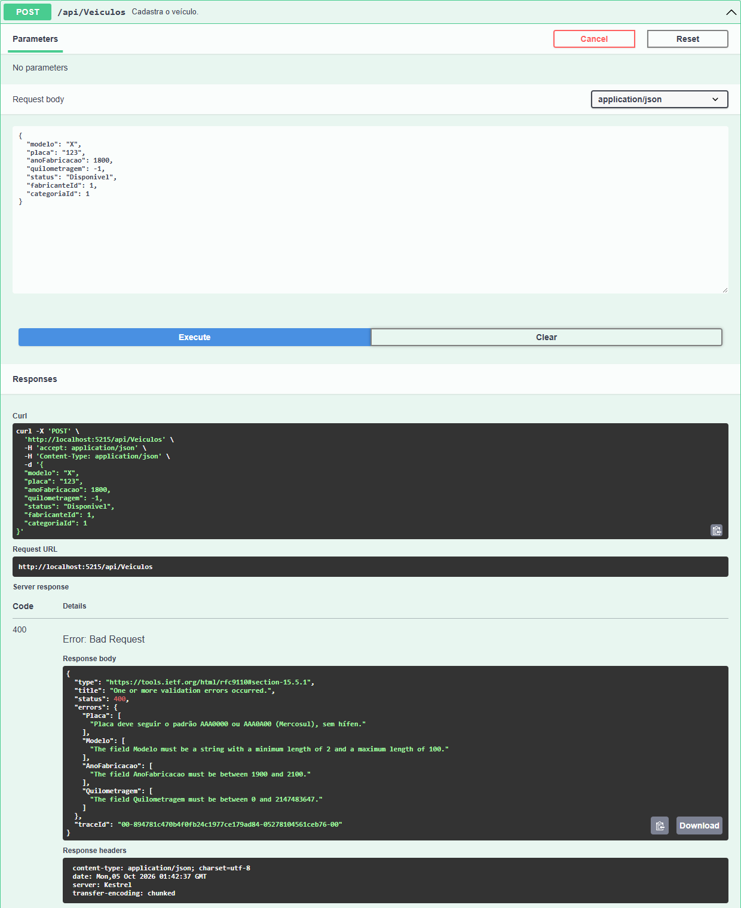

<a id="teste-21"></a>
### Teste 21 - Remover veículo

- **Chamada:** `DELETE /api/Veiculos/5`
- **Status retornado:** `204`

**Retorno:**

```json
date: Mon,05 Oct 2026 01:42:41 GMT 
 server: Kestrel
```


<a id="teste-22"></a>
### Teste 22 - Filtro 1 - Veículos disponíveis (sem filtros)

- **Chamada:** `GET /api/Veiculos/disponiveis`
- **Status retornado:** `200`

**Retorno:**

```json
[
  {
    "id": 2,
    "modelo": "Argo",
    "placa": "DEF4G56",
    "anoFabricacao": 2023,
    "quilometragem": 8000,
    "status": "Disponivel",
    "fabricanteId": 2,
    "fabricanteNome": "Fiat Automóveis",
    "categoriaId": 1,
    "categoriaNome": "Econômico",
    "valorDiariaBase": 120
  },
  {
    "id": 1,
    "modelo": "Corolla",
    "placa": "ABC1D23",
    "anoFabricacao": 2022,
    "quilometragem": 15000,
    "status": "Disponivel",
    "fabricanteId": 1,
    "fabricanteNome": "Toyota",
    "categoriaId": 1,
    "categoriaNome": "Econômico",
    "valorDiariaBase": 120
  },
  {
    "id": 3,
    "modelo": "Hilux SW4",
    "placa": "GHI7J89",
    "anoFabricacao": 2021,
    "quilometragem": 43500,
    "status": "Disponivel",
    "fabricanteId": 1,
    "fabricanteNome": "Toyota",
    "categoriaId": 2,
    "categoriaNome": "SUV",
    "valorDiariaBase": 280
  }
]
```

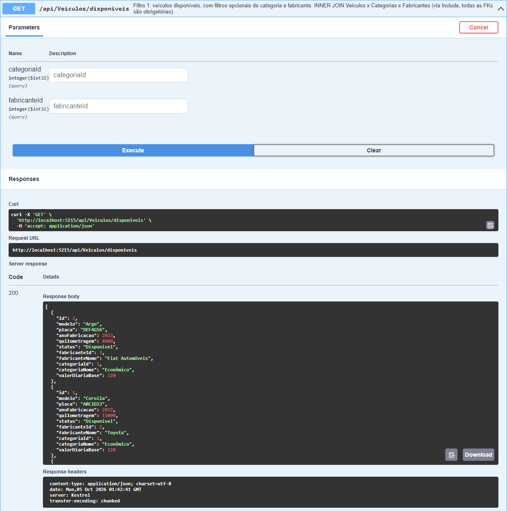

<a id="teste-23"></a>
### Teste 23 - Filtro 2 - Veículos por fabricante

- **Chamada:** `GET /api/Veiculos/por-fabricante/1`
- **Status retornado:** `200`

**Retorno:**

```json
[
  {
    "id": 1,
    "modelo": "Corolla",
    "placa": "ABC1D23",
    "anoFabricacao": 2022,
    "quilometragem": 15000,
    "status": "Disponivel",
    "fabricanteId": 1,
    "fabricanteNome": "Toyota",
    "categoriaId": 1,
    "categoriaNome": "Econômico",
    "valorDiariaBase": 120
  },
  {
    "id": 3,
    "modelo": "Hilux SW4",
    "placa": "GHI7J89",
    "anoFabricacao": 2021,
    "quilometragem": 43500,
    "status": "Disponivel",
    "fabricanteId": 1,
    "fabricanteNome": "Toyota",
    "categoriaId": 2,
    "categoriaNome": "SUV",
    "valorDiariaBase": 280
  }
]
```

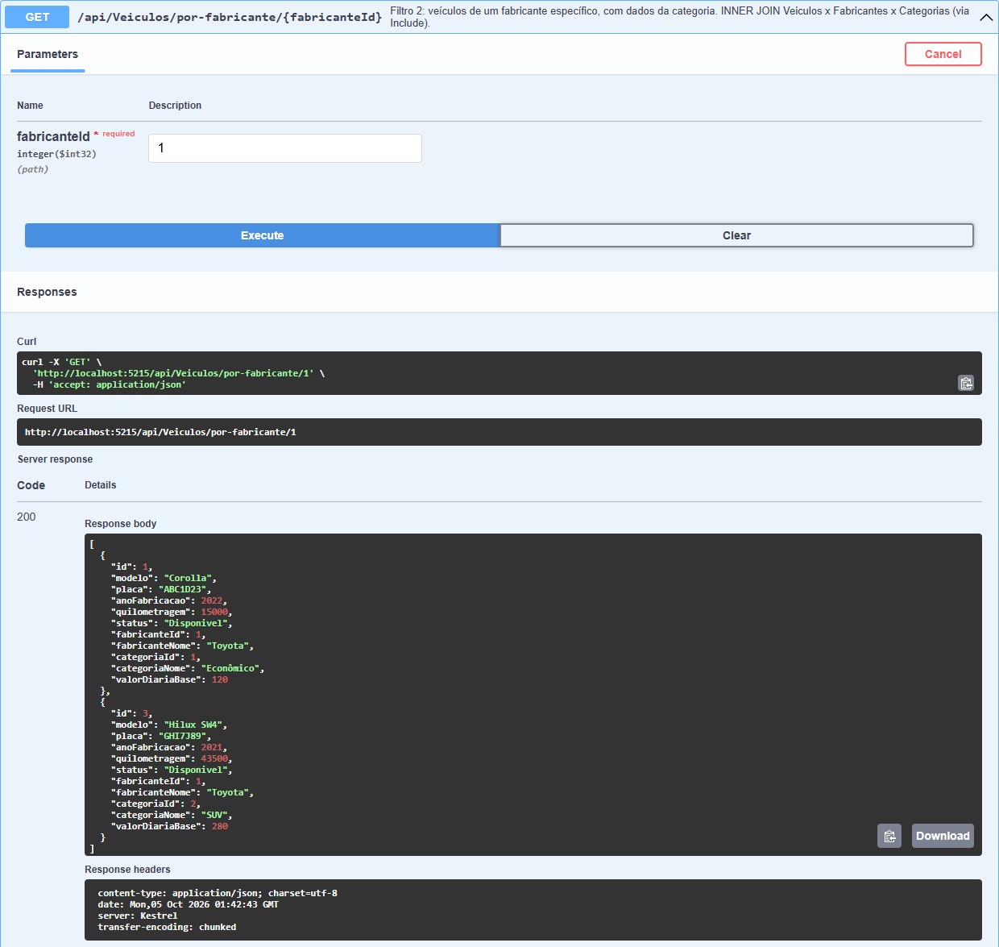

## Aluguéis

<a id="teste-25"></a>
### Teste 25 - Registrar aluguel (João x Corolla)

- **Chamada:** `POST /api/Alugueis`
- **Status retornado:** `201`

**Corpo enviado:**

```json
{
  "clienteId": 1,
  "veiculoId": 1,
  "dataRetirada": "2026-10-05T01:42:46",
  "dataPrevistaDevolucao": "2026-10-10T01:42:46",
  "valorDiaria": 120
}
```

**Retorno:**

```json
{
  "id": 1,
  "dataRetirada": "2026-10-05T01:42:46",
  "dataPrevistaDevolucao": "2026-10-10T01:42:46",
  "dataDevolucao": null,
  "kmInicial": 15000,
  "kmFinal": null,
  "valorDiaria": 120,
  "valorTotal": null,
  "clienteId": 1,
  "clienteNome": "João da Silva",
  "veiculoId": 1,
  "veiculoModelo": "Corolla",
  "veiculoPlaca": "ABC1D23"
}
```

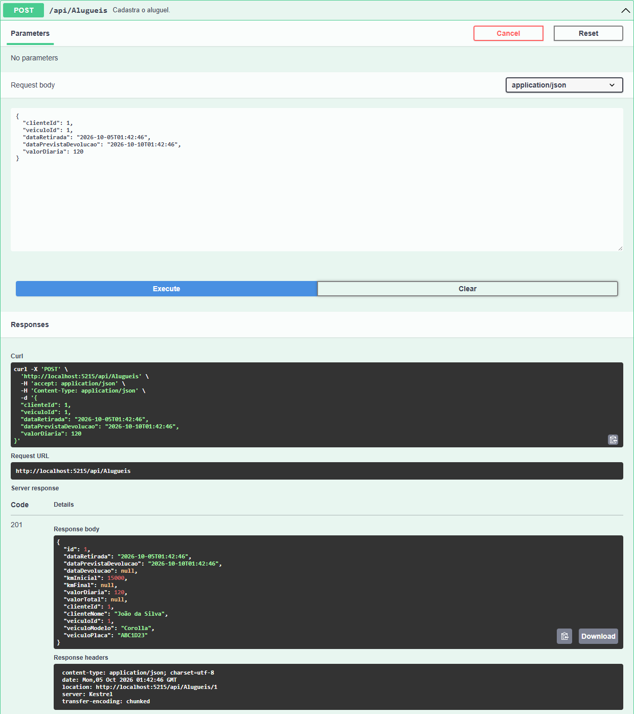

<a id="teste-26"></a>
### Teste 26 - Registrar aluguel de veículo já alugado (409)

- **Chamada:** `POST /api/Alugueis`
- **Status retornado:** `409`

**Corpo enviado:**

```json
{
  "clienteId": 2,
  "veiculoId": 1,
  "dataRetirada": "2026-10-05T01:42:47",
  "dataPrevistaDevolucao": "2026-10-08T01:42:47",
  "valorDiaria": 120
}
```

**Retorno:**

```json
{
  "mensagem": "Veículo ABC1D23 não está disponível para locação (status atual: Alugado)."
}
```

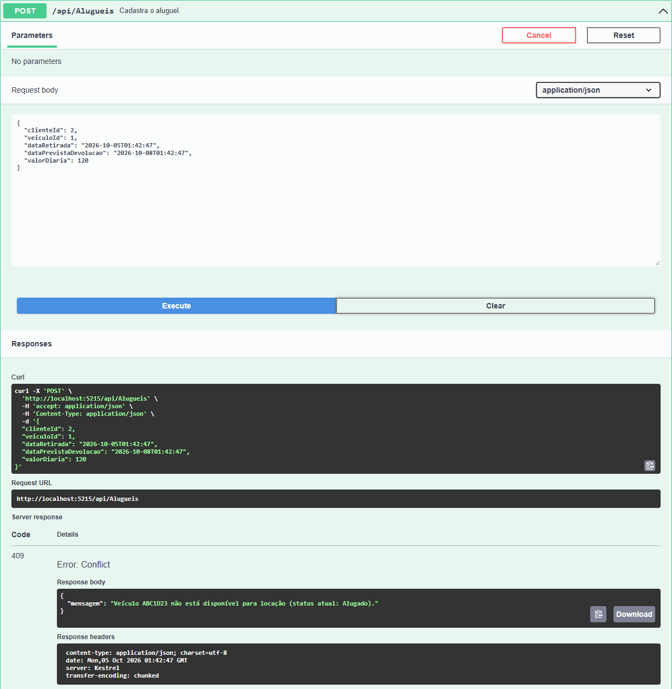

<a id="teste-27"></a>
### Teste 27 - Listar aluguéis

- **Chamada:** `GET /api/Alugueis`
- **Status retornado:** `200`

**Retorno:**

```json
[
  {
    "id": 1,
    "dataRetirada": "2026-10-05T01:42:46",
    "dataPrevistaDevolucao": "2026-10-10T01:42:46",
    "dataDevolucao": null,
    "kmInicial": 15000,
    "kmFinal": null,
    "valorDiaria": 120,
    "valorTotal": null,
    "clienteId": 1,
    "clienteNome": "João da Silva",
    "veiculoId": 1,
    "veiculoModelo": "Corolla",
    "veiculoPlaca": "ABC1D23"
  },
  {
    "id": 2,
    "dataRetirada": "2026-09-25T01:42:49",
    "dataPrevistaDevolucao": "2026-09-30T01:42:49",
    "dataDevolucao": null,
    "kmInicial": 8000,
    "kmFinal": null,
    "valorDiaria": 130,
    "valorTotal": null,
    "clienteId": 2,
    "clienteNome": "Maria Souza",
    "veiculoId": 2,
    "veiculoModelo": "Argo",
    "veiculoPlaca": "DEF4G56"
  }
]
```

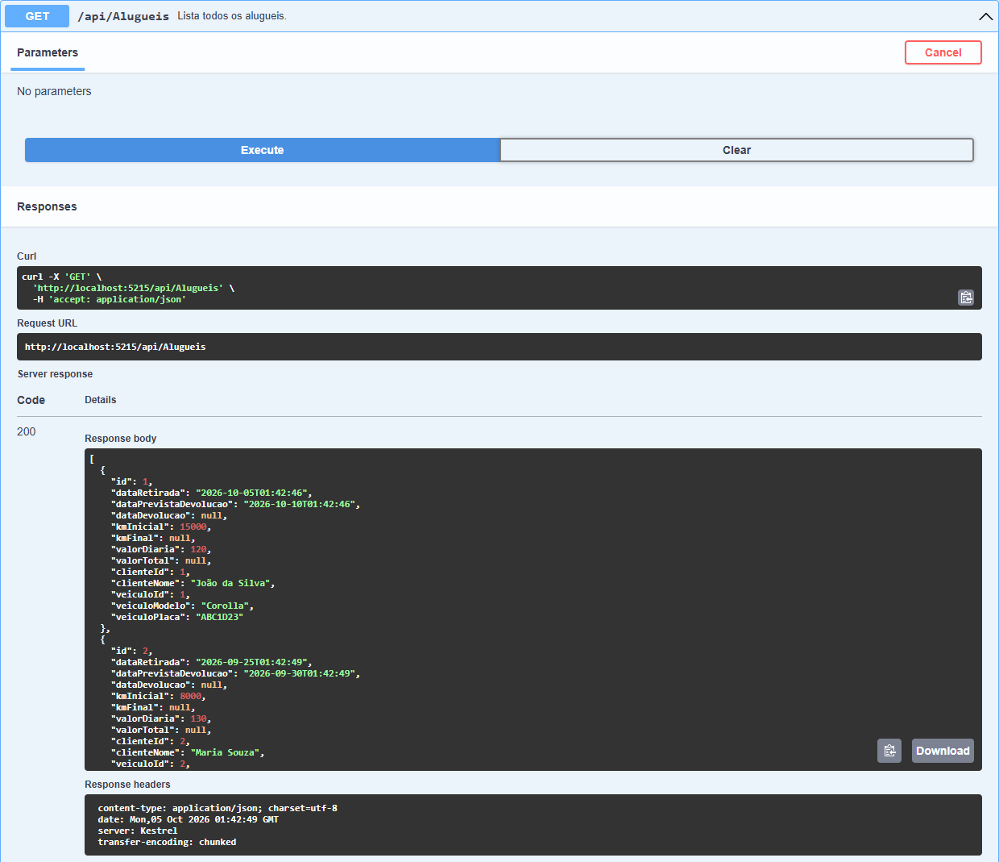

<a id="teste-28"></a>
### Teste 28 - Obter aluguel por Id

- **Chamada:** `GET /api/Alugueis/1`
- **Status retornado:** `200`

**Retorno:**

```json
{
  "id": 1,
  "dataRetirada": "2026-10-05T01:42:46",
  "dataPrevistaDevolucao": "2026-10-10T01:42:46",
  "dataDevolucao": null,
  "kmInicial": 15000,
  "kmFinal": null,
  "valorDiaria": 120,
  "valorTotal": null,
  "clienteId": 1,
  "clienteNome": "João da Silva",
  "veiculoId": 1,
  "veiculoModelo": "Corolla",
  "veiculoPlaca": "ABC1D23"
}
```

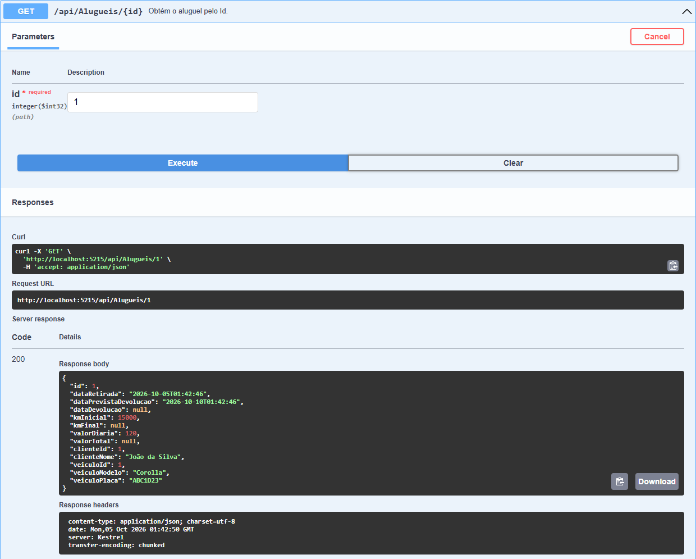

<a id="teste-29"></a>
### Teste 29 - Atualizar aluguel

- **Chamada:** `PUT /api/Alugueis/1`
- **Status retornado:** `204`

**Corpo enviado:**

```json
{
  "dataRetirada": "2026-10-05T01:42:53",
  "dataPrevistaDevolucao": "2026-10-12T01:42:53",
  "valorDiaria": 115
}
```

**Retorno:**

```json
date: Mon,05 Oct 2026 01:42:52 GMT 
 server: Kestrel
```

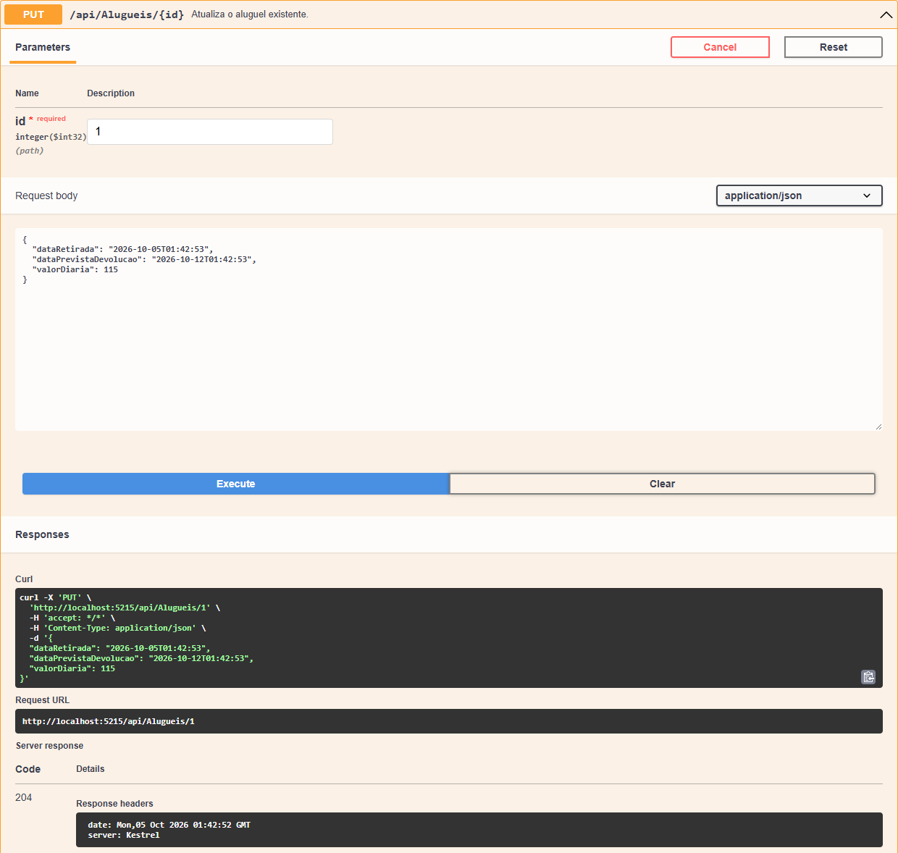

<a id="teste-30"></a>
### Teste 30 - Filtro 3 - Aluguéis por cliente

- **Chamada:** `GET /api/Alugueis/por-cliente/1`
- **Status retornado:** `200`

**Retorno:**

```json
[
  {
    "id": 1,
    "dataRetirada": "2026-10-05T01:42:53",
    "dataPrevistaDevolucao": "2026-10-12T01:42:53",
    "dataDevolucao": null,
    "kmInicial": 15000,
    "kmFinal": null,
    "valorDiaria": 115,
    "valorTotal": null,
    "clienteId": 1,
    "clienteNome": "João da Silva",
    "veiculoId": 1,
    "veiculoModelo": "Corolla",
    "veiculoPlaca": "ABC1D23"
  }
]
```

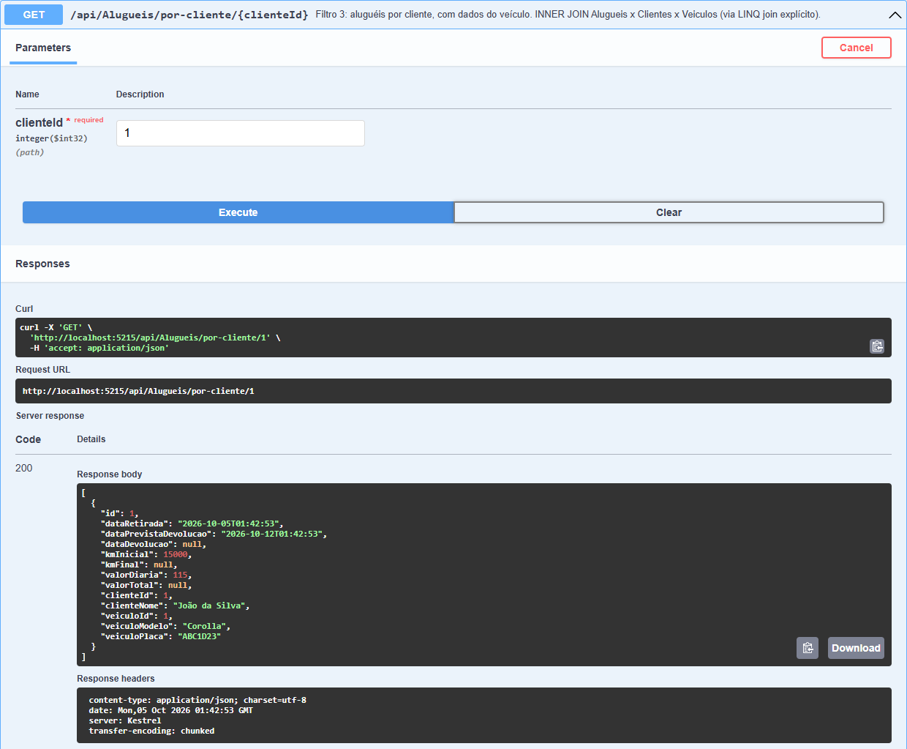

<a id="teste-31"></a>
### Teste 31 - Filtro 4 - Aluguéis atrasados

- **Chamada:** `GET /api/Alugueis/atrasados`
- **Status retornado:** `200`

**Retorno:**

```json
[
  {
    "id": 2,
    "dataRetirada": "2026-09-25T01:42:49",
    "dataPrevistaDevolucao": "2026-09-30T01:42:49",
    "dataDevolucao": null,
    "kmInicial": 8000,
    "kmFinal": null,
    "valorDiaria": 130,
    "valorTotal": null,
    "clienteId": 2,
    "clienteNome": "Maria Souza",
    "veiculoId": 2,
    "veiculoModelo": "Argo",
    "veiculoPlaca": "DEF4G56"
  }
]
```

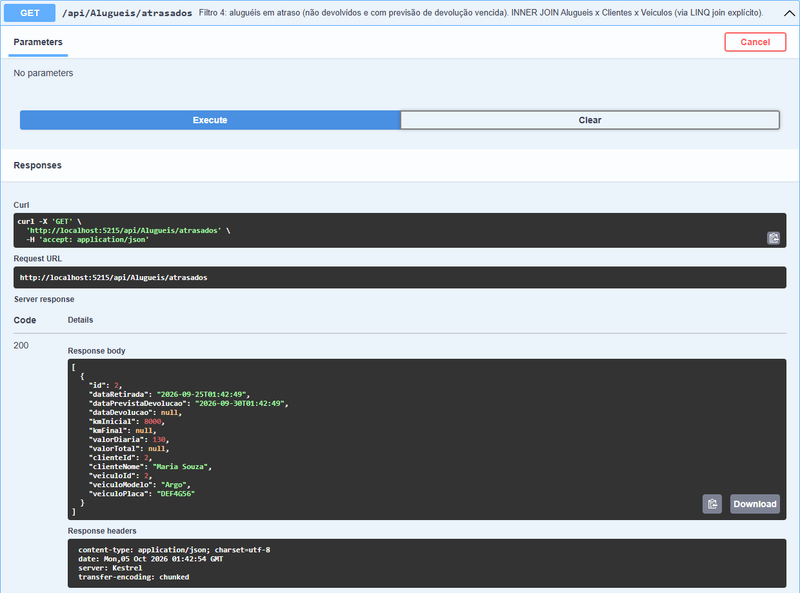

<a id="teste-33"></a>
### Teste 33 - Registrar devolução do veículo

- **Chamada:** `POST /api/Alugueis/2/devolucao`
- **Status retornado:** `200`

**Corpo enviado:**

```json
{
  "dataDevolucao": "2026-10-05T01:42:56",
  "kmFinal": 8900
}
```

**Retorno:**

```json
{
  "id": 2,
  "dataRetirada": "2026-09-25T01:42:49",
  "dataPrevistaDevolucao": "2026-09-30T01:42:49",
  "dataDevolucao": "2026-10-05T01:42:56",
  "kmInicial": 8000,
  "kmFinal": 8900,
  "valorDiaria": 130,
  "valorTotal": 1430,
  "clienteId": 2,
  "clienteNome": "Maria Souza",
  "veiculoId": 2,
  "veiculoModelo": "Argo",
  "veiculoPlaca": "DEF4G56"
}
```

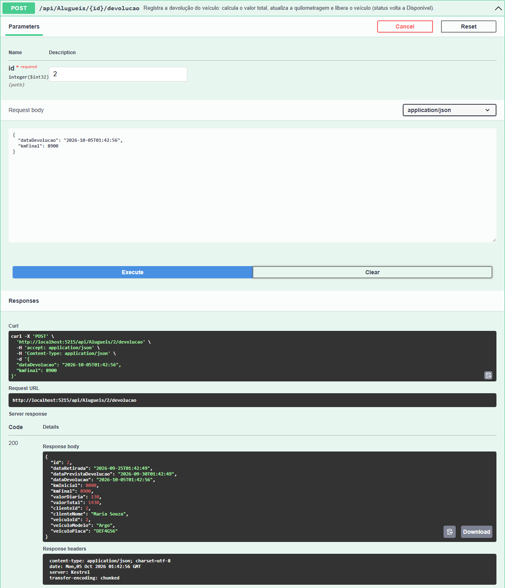

<a id="teste-34"></a>
### Teste 34 - Devolução repetida (409)

- **Chamada:** `POST /api/Alugueis/2/devolucao`
- **Status retornado:** `409`

**Corpo enviado:**

```json
{
  "kmFinal": 9000
}
```

**Retorno:**

```json
{
  "mensagem": "Aluguel já foi devolvido."
}
```

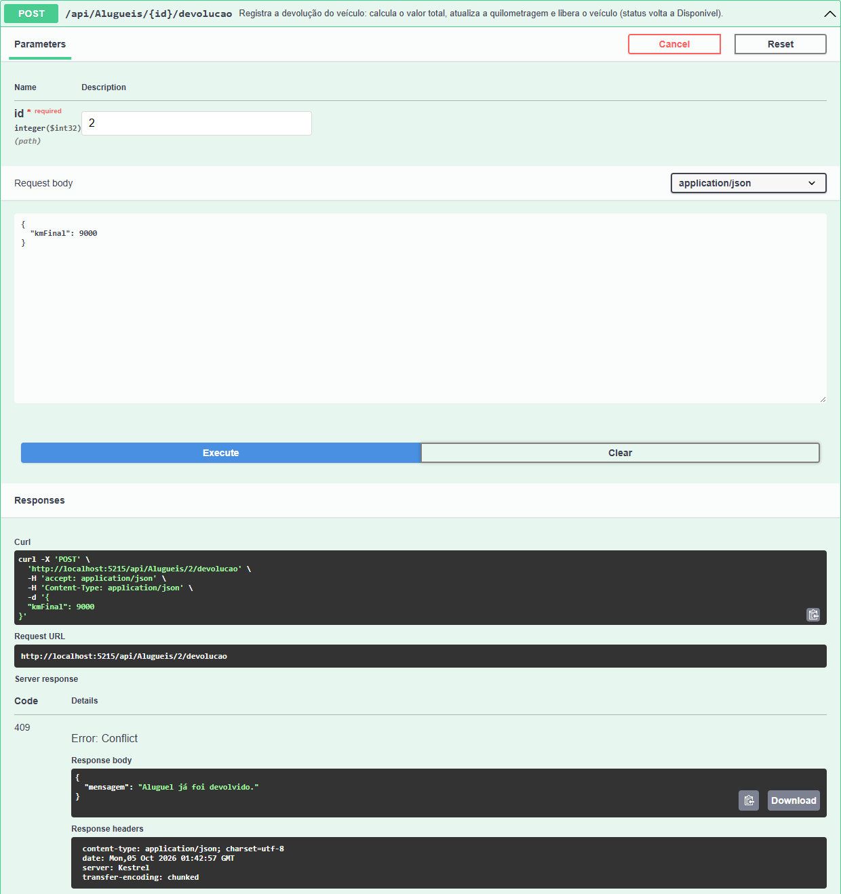

<a id="teste-35"></a>
### Teste 35 - Remover aluguel

- **Chamada:** `DELETE /api/Alugueis/1`
- **Status retornado:** `204`

**Retorno:**

```json
date: Mon,05 Oct 2026 01:42:59 GMT 
 server: Kestrel
```


